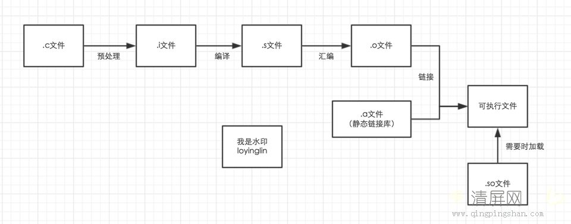

# Makefile

## 一、编译基础




## 二、概要

### 1、Makefile目的：

1）树型的依赖结构文件生成目标文件

2）当依赖文件修改时间是比目标新，则新文件往上依赖需要重新生成

命令行：make

文件：Makefile

```makefile
a.txt: b.txt c.txt
     cat b.txt c.txt > a.txt
```

```makefile
$ make -f rules.txt
# 或者
$ make --file=rules.txt
```

