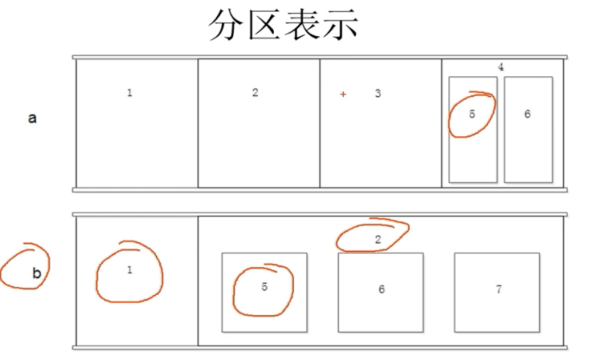
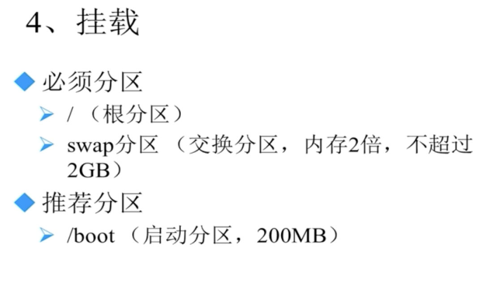
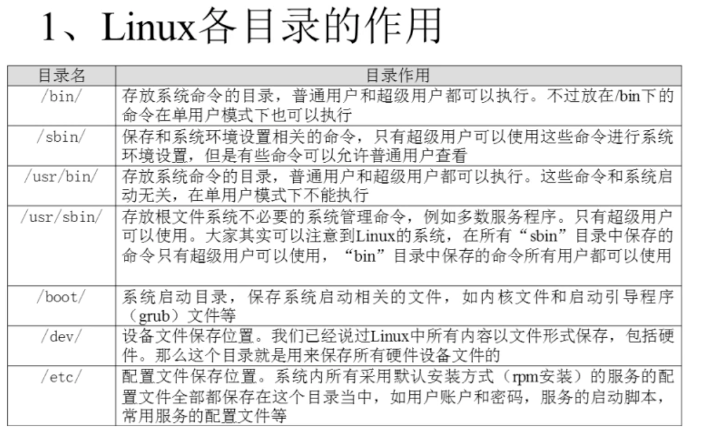

# linux知识


## 一、分区

> 类型与windows的盘符，最多只有4个
>
> 主分区:最多只有4个 （主分区+扩展分区最多4个）
>
> 扩展分区：只能有1个；不能格式化写入数据；只能包含逻辑分区；
>
> 逻辑分区：可以格式化，写入数据 （逻辑分区是5开始的）
>
> 格式化：是逻辑格式化，最小存放单元 ext4,

/boot 是系统启动的分区 是磁盘的最前面

/home 分区是用户数据存放的地方

swap 分区


### 硬件设备文件名






## 二、网络

1、桥接：用宿主机网卡，跟宿主机同个网段，不同的ip

2、NAT：是宿主机的下级虚拟网卡，可以跟外面机器联网 （虚拟机的话可以在宿主机查看ip地址）

3、Host-only:是宿主机的下级虚拟网卡，不可以跟外面机器联网

```
# NAT 配置以太网 
ifconfig eth0 192.168.1.2
```


## 三、目录作用



