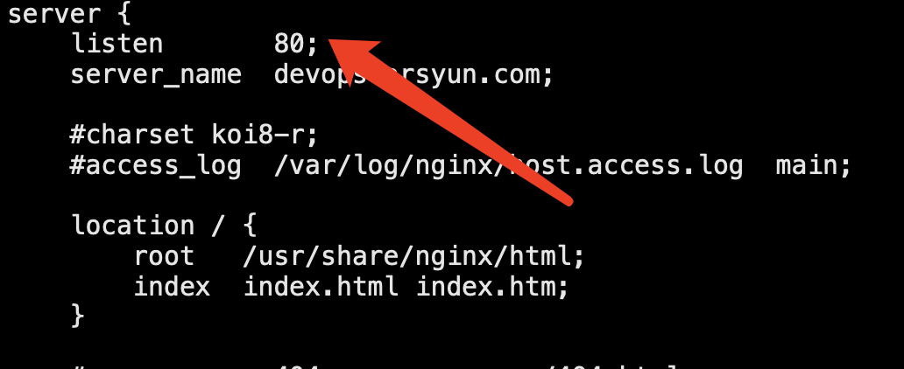

# Nginx Https配置


[CentOS7.X中使用yum安装nginx的方法](https://www.cnblogs.com/opsprobe/p/10773582.html)

## 一、环境安装

### 安装前准备

```shell
yum install yum-utils
```

###  添加源

```shell
# 到 cd /etc/yum.repos.d/ 目录下新建 vim nginx.repo 文件，输入以下信息
vim /etc/yum.repos.d/nginx.repo
```

```shell
[nginx-stable]
name=nginx stable repo
baseurl=http://nginx.org/packages/centos/$releasever/$basearch/
gpgcheck=1
enabled=1
gpgkey=https://nginx.org/keys/nginx_signing.key

[nginx-mainline]
name=nginx mainline repo
baseurl=http://nginx.org/packages/mainline/centos/$releasever/$basearch/
gpgcheck=1
enabled=0
gpgkey=https://nginx.org/keys/nginx_signing.key
```

### 安装Nginx

通过yum search nginx看看是否已经添加源成功。如果成功则执行下列命令安装nginx。

```shell
# 看看是否已经添加源成功
yum search nginx

# 如果成功则执行下列命令安装nginx。
yum install nginx

# 查看
rpm -qa | grep nginx

# 启动
systemctl start nginx

# 加入开机启动
systemctl enable nginx

# 查看nginx的状态
systemctl status nginx
```

> 在浏览器输入自己服务器的IP地址即可访问到nginx，如下图所示，nginx服务的默认端口为80（这里需要注意防火墙的限制和端口冲突）

```shell
# 可查看80端口被那个进程占用。
lsof -i:80
# nginx服务的默认配置文件在 
cat /etc/nginx/conf.d/default.conf
# 打开可看到，默认端口为80，项目部署目录为/usr/share/nginx/html/。

```




## 二、配置域名

阿里云配置 134.175.88.78   devops.arsyun.com


## 三、安装防火墙软件

### nginx启动报错

今天在centos7部署nginx，安装时一切顺利，但是在启动的时候却报错了，提示如下错误：
nginx: [emerg] bind() to 0.0.0.0:80 failed (98: Address already in use)
nginx: [emerg] bind() to 0.0.0.0:80 failed (98: Address already in use)
nginx: [emerg] bind() to 0.0.0.0:80 failed (98: Address already in use)
nginx: [emerg] bind() to 0.0.0.0:80 failed (98: Address already in use)

后经排查，原来是端口占用了。nginx默认启动端口是80，之前刚好在这个服务器启动了个80端口的tomcat。现解决方式如下：

### 安装iptables服务

需要通过防火墙开放对外端口。如果服务器上没有iptables服务，需要安装。如果有，则跳过。

```
yum install iptables-services
systemctl mask firewalld.service
systemctl enable iptables.service
systemctl enable ip6tables.service
```

### 配置端口

进入iptables配置80端口，因为nginx默认是由80端口访问

打开后，默认的配置信息如下（443,21,22,80)

后续需要开放其它端口，也是在此文件中添加修改即可！

修改完后，保存退出文件编辑。

```shell
[root@VM_0_14_centos ~]# cat /etc/sysconfig/iptables
# sample configuration for iptables service
# you can edit this manually or use system-config-firewall
# please do not ask us to add additional ports/services to this default configuration
*filter
:INPUT ACCEPT [0:0]
:FORWARD ACCEPT [0:0]
:OUTPUT ACCEPT [0:0]
-A INPUT -m state --state RELATED,ESTABLISHED -j ACCEPT
-A INPUT -p icmp -j ACCEPT
-A INPUT -i lo -j ACCEPT
-A INPUT -p tcp -m state --state NEW -m tcp --dport 22 -j ACCEPT
-A INPUT -p tcp -m state --state NEW -m tcp --dport 21 -j ACCEPT
-A INPUT -p tcp -m state --state NEW -m tcp --dport 80 -j ACCEPT
# -A INPUT -p tcp -m state --state NEW -m tcp --dport 8888 -j ACCEPT
-A INPUT -p tcp -m state --state NEW -m tcp --dport 443 -j ACCEPT
-A INPUT -j REJECT --reject-with icmp-host-prohibited
-A FORWARD -j REJECT --reject-with icmp-host-prohibited
COMMIT
```

### 重启防火墙

```
systemctl restart iptables.service
```

### 查看80端口被占用的进程

```
lsof -i:80
```

通过kill命令干掉该进程

```
kill -9 进程号
```

### 启动nginx

这个时候在启动nginx，一切正常了！

```shell
systemctl restart nginx
```


## 四、配置https

```shell
# 配置https
vim /etc/nginx/conf.d/default.conf
```

```
server {
	listen 443 ssl;
	server_name devops.arsyun.com;

	ssl_certificate /etc/nginx/conf.d/sky.pem;
	ssl_certificate_key /etc/nginx/conf.d/sky.key;

	ssl_session_cache shared:SSL:1m;
	ssl_session_timeout 5m;

	ssl_ciphers HIGH:!aNULL:!MD5;
	ssl_prefer_server_ciphers on;

	location / {
		# root html;
		# index index.html index.htm;
		proxy_pass http://127.0.0.1:8888;
	}
}
```

```shell
# 重启nginx
systemctl restart nginx
```

```shell
# 开:8888服务 访问接口
http://devops.arsyun.com 
```

