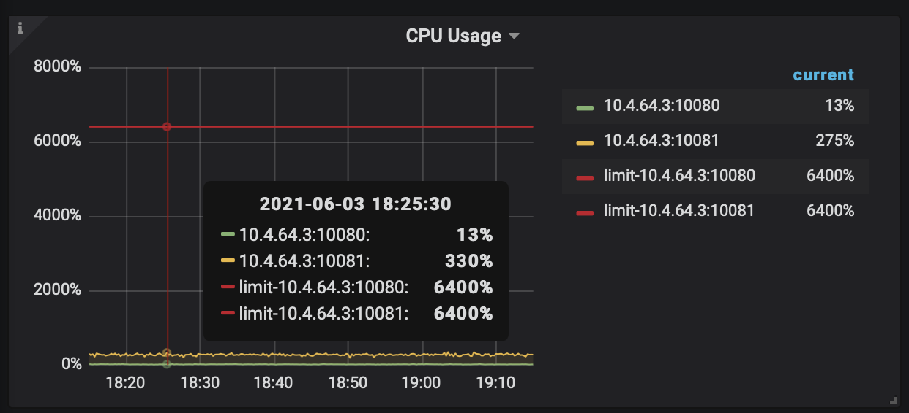
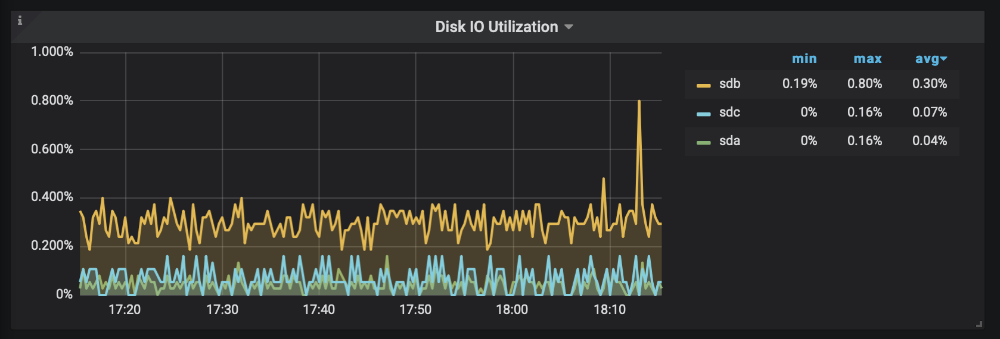
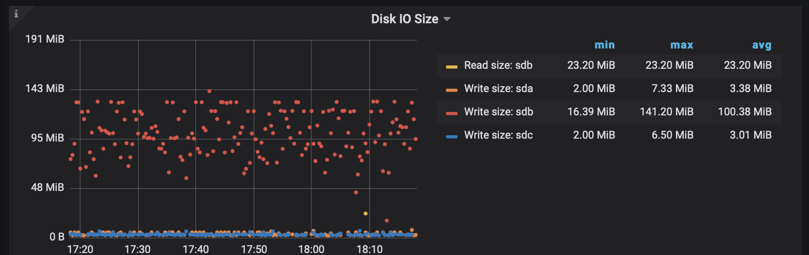
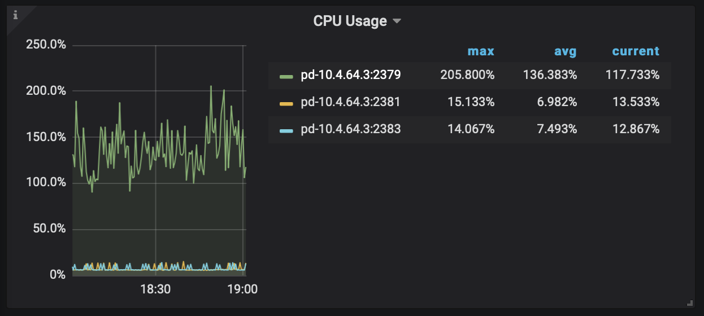
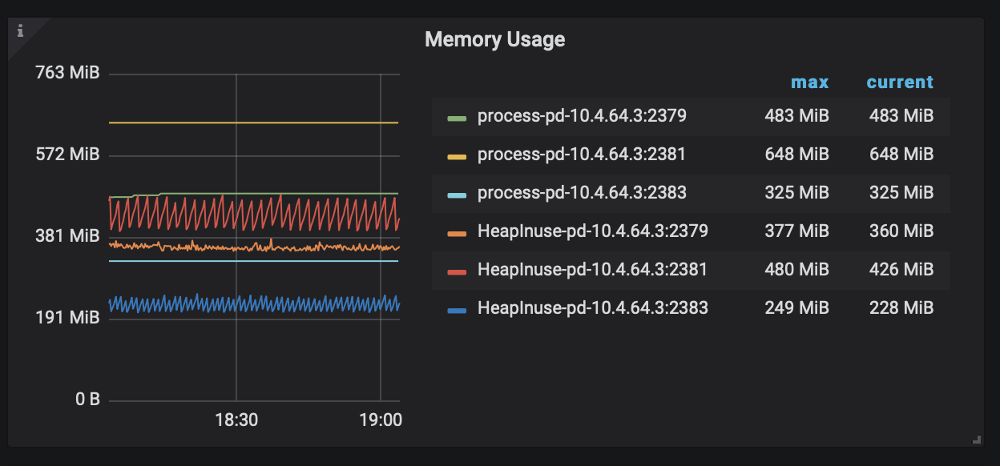
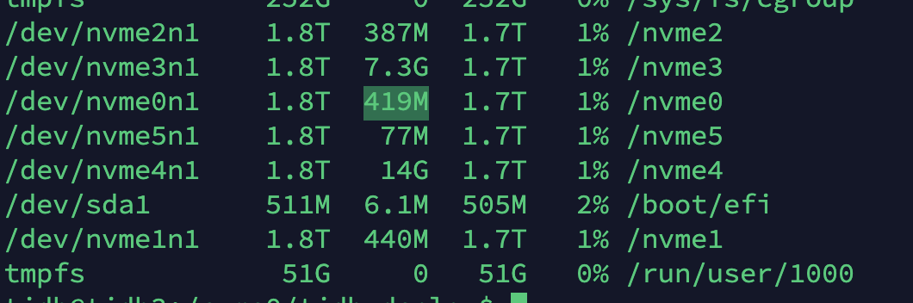
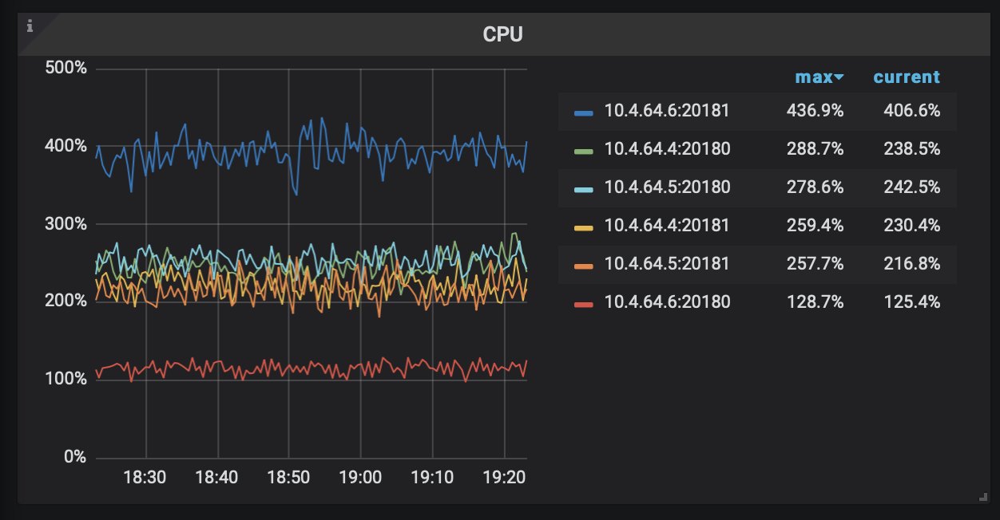
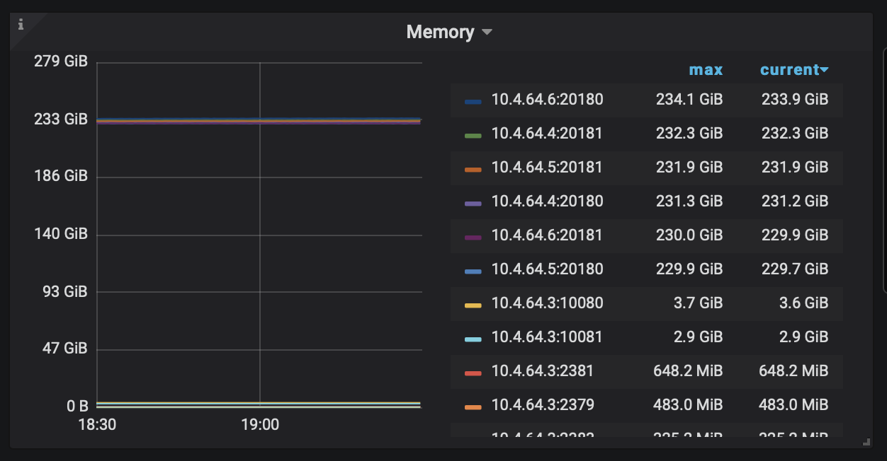
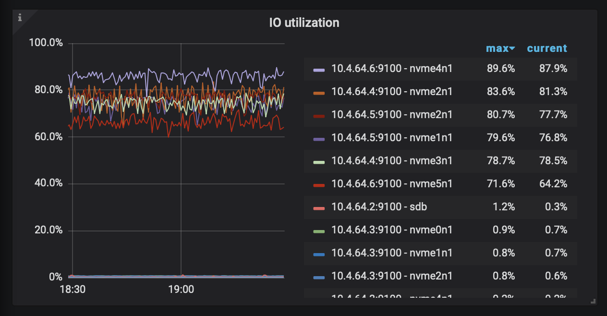
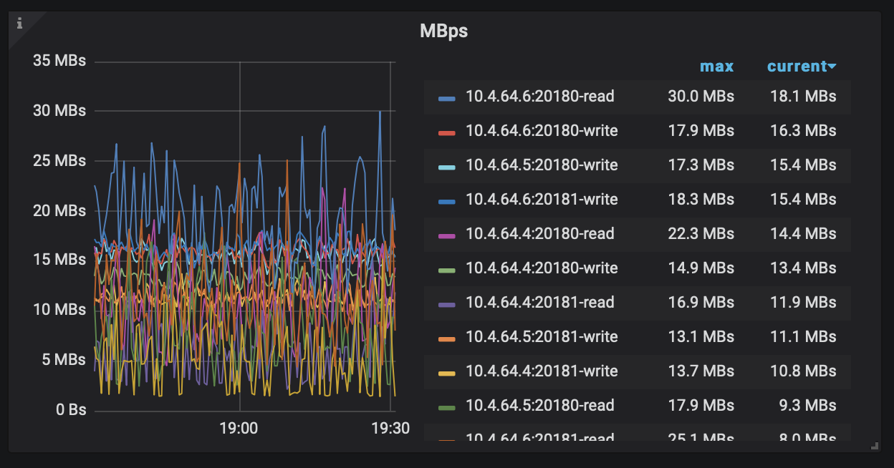

# 一、Tidb性能测试


## 集群环境

### 硬件

| Cpu AMD 7502；512G内存;6个Nvme | 4    |
| ------------------------------ | ---- |
| Cpu AMD 7742；512G内存;6个Nvme | 1    |
| Cpu Intel E5-2683; 256G内存    | 1    |


| 服务                         | 个数 |
| ---------------------------- | ---- |
| pd （Cpu AMD 7502）          | 3    |
| grafana （Intel E5-2683）    | 1    |
| prometheus （Intel E5-2683） | 1    |
| tidb （Cpu AMD 7502）        | 3    |
| tiflash （Cpu AMD 7742）     | 1    |
| tikv（Cpu AMD 7502）         | 6    |


## 硬件监控

> 16个表 10亿记录并行入库测试


### Tidb Server硬件监控

> SQL 层，对外暴露 MySQL 协议的连接 endpoint，负责接受客户端的连接，执行 SQL 解析和优化，最终生成分布式执行计划。TiDB 层本身是无状态的，实践中可以启动多个 TiDB 实例，通过负载均衡组件（如 LVS、HAProxy 或 F5）对外提供统一的接入地址，客户端的连接可以均匀地分摊在多个 TiDB 实例上以达到负载均衡的效果。TiDB Server 本身并不存储数据，只是解析 SQL，将实际的数据读取请求转发给底层的存储节点 TiKV（或 TiFlash）。

#### CPU

> TidbServer Cpu用满




#### 内存

> TidbServer 对内存要求不高 


#### 硬盘

> TidbServer对磁盘使用不高，ssd够用



> TidbServer 磁盘写入速度最大 100.02 MiB/s （普通ssd正常写入速度：200M/S；400-600M/s）
>
> TidbServer 磁盘的ssd 是可以够用的




> 结论：  TidbServer 只对CPU线程数要求高，内存磁盘都不高


### PD Server硬件监控

> 整个 TiDB 集群的元信息管理模块，负责存储每个 TiKV 节点实时的数据分布情况和集群的整体拓扑结构，提供 TiDB Dashboard 管控界面，并为分布式事务分配事务 ID。PD 不仅存储元信息，同时还会根据 TiKV 节点实时上报的数据分布状态，下发数据调度命令给具体的 TiKV 节点，可以说是整个集群的“大脑”。此外，PD 本身也是由至少 3 个节点构成，拥有高可用的能力。建议部署奇数个 PD 节点。

#### CPU

> CPU使用率 3个长期占用两个线程




#### 内存

> 最大内存 3GB对内存要求不高




#### 磁盘

> 容量要求不高



> 结论：  PD Server 只对硬件要求不高


### TIKV Server硬件监控

> 负责存储数据，从外部看 TiKV 是一个分布式的提供事务的 Key-Value 存储引擎。存储数据的基本单位是 Region，每个 Region 负责存储一个 Key Range（从 StartKey 到 EndKey 的左闭右开区间）的数据，每个 TiKV 节点会负责多个 Region。TiKV 的 API 在 KV 键值对层面提供对分布式事务的原生支持，默认提供了 SI (Snapshot Isolation) 的隔离级别，这也是 TiDB 在 SQL 层面支持分布式事务的核心。TiDB 的 SQL 层做完 SQL 解析后，会将 SQL 的执行计划转换为对 TiKV API 的实际调用。所以，数据都存储在 TiKV 中。另外，TiKV 中的数据都会自动维护多副本（默认为三副本），天然支持高可用和自动故障转移。

#### CPU

> 每个服务占用8个线程 ，64线程机器够用，可以一台机器开几个服务




#### 内存

> 每个服务占用234GB内存，与内存要求很高



#### 硬盘

> 每个服务IO用满、写入速度30MB/s





> 结论：  TIKV Server 只对硬件很高，决定了数据库快慢点

### TIFlash Server 硬件监控

> 暂不使用，后续添加


## 性能测试

> QPS（Queries Per Second，每秒查询数）
> TPS（Transactions Per Second，每秒处理事务数
>
> 响应时间（95% latency (ms)）


### 3亿数据

####  Update性能

| 表大小 | Threads | QPS      | TPS      | 95% latency (ms) |
| ------ | ------- | -------- | -------- | ---------------- |
| 3亿    | 16      | 672.18   | 672.18   | 49.21            |
| 3亿    | 32      | 1246.17  | 1246.17  | 42.61            |
| 3亿    | 64      | 3341.90  | 3341.90  | 36.24            |
| 3亿    | 128     | 3553.72  | 3553.72  | 99.33            |
| 3亿    | 256     | 8274.90  | 8274.90  | 81.48            |
| 3亿    | 512     | 9208.97  | 9208.97  | 155.80           |
| 3亿    | 1024    | 16178.65 | 16178.65 | 186.54           |
| 3亿    | 2048    | 14339.99 | 14339.99 | 350.33           |


#### Select性能

| 表大小 | Threads | QPS       | TPS       | 95% latency (ms) |
| ------ | ------- | --------- | --------- | ---------------- |
| 3亿    | 16      | 33527.01  | 33527.01  | 0.87             |
| 3亿    | 32      | 62279.68  | 62279.68  | 0.94             |
| 3亿    | 64      | 113072.00 | 113072.00 | 0.95             |
| 3亿    | 128     | 215836.66 | 215836.66 | 1.37             |
| 3亿    | 256     | 261870.66 | 261870.66 | 2.52             |
| 3亿    | 512     | 269895.62 | 269895.62 | 5.99             |
| 3亿    | 1024    | 268735.77 | 268735.77 | 17.63            |
| 3亿    | 2048    | 284136.80 | 284136.80 | 20.74            |


#### Select性能

| 表大小 | Threads | QPS       | TPS       | 95% latency (ms) |
| ------ | ------- | --------- | --------- | ---------------- |
| 6亿    | 1024    | 287138.04 | 287138.04 | 15.83            |
| 6亿    | 2048    | 287595.82 | 287595.82 | 20.74            |


> 
>
> Tidb集群 单个服务 3亿表最大Tps为 16178.65 ； 最大Qps为：284136.80 ；算是很好的吞吐量了


## 各类型数据库QPS对比

| 数据库类型 | 机器 | QPS       |
| ---------- | ---- | --------- |
| TIDB       | 集群 | 284136.80 |
| MongoDb    | 单机 | 28000     |
| MySQL      | 单机 | 40000     |
| PostgreSQL | 单机 | 50000     |
| Redis      | 单机 | 80000     |
| Tomcat     | 单机 | 20000     |

> 其他类型数据库没做真实的QPS测试，是在网上找的数据，单机吞吐量比不上TIdb吞吐量正常了，一般业务吞吐量3000就足够了，吞吐量大，是高并发时才体现出来


## 二、SQL慢查询

### 测试的表结构

```sql
CREATE TABLE `sbtest8` (
  `id` int(11) NOT NULL AUTO_INCREMENT,
  `k` int(11) NOT NULL DEFAULT '0',
  `c` char(120) NOT NULL DEFAULT '',
  `pad` char(60) NOT NULL DEFAULT '',
  PRIMARY KEY (`id`) /*T![clustered_index] CLUSTERED */,
  KEY `k_8` (`k`)
) ENGINE=InnoDB DEFAULT CHARSET=utf8mb4 COLLATE=utf8mb4_bin AUTO_INCREMENT=953264358;
```

### 慢查询指标


| 表大小 | Tikv       | 描述                        | sql                                                          | 时间    | 总结                              |
| ------ | ---------- | --------------------------- | ------------------------------------------------------------ | ------- | --------------------------------- |
| 3亿    | 6+内存无限 | LIMIT = 1（不走索引）       | SELECT * FROM `sbtest`.`sbtest8` LIMIT 0, 100;               | 0.189s  | 第一页很快，跟表大小无关          |
| 3亿    | 6+内存无限 | LIMIT = 3亿（不走索引）     | SELECT * FROM `sbtest`.`sbtest8` LIMIT 300000000, 100;       | 54.865s | LIMIT越大，分页越慢，跟表大小无关 |
| 3亿    | 6+内存无限 | LIMIT = 3亿（走Id主键）     | SELECT * FROM `sbtest`.`sbtest8` ORDER BY id LIMIT 300000000, 100; | 55.2s   | 主键分页慢                        |
| 3亿    | 6+内存无限 | LIMIT = 3亿（走k主键）      | SELECT * FROM `sbtest`.`sbtest8` ORDER BY k LIMIT 300000000, 100; | 10.317s | 索引分页慢                        |
| 3亿    | 6+内存无限 | LIMIT = 1（走Id主键）逆序   | SELECT * FROM `sbtest`.`sbtest8` ORDER BY id DESC LIMIT 0, 100; | 0.032s  | 最后一页很快，跟表大小无关        |
| 3亿    | 6+内存无限 | LIMIT = 3亿（走Id索引）逆序 | SELECT * FROM `sbtest`.`sbtest8` ORDER BY id DESC LIMIT 300000000, 100; | 58.11s  | 顺序逆序排序效率基本一样          |
| 3亿    | 6+内存无限 | COUNT(*)                    | SELECT COUNT(*) FROM `sbtest`.`sbtest8`                      | 12s     | 统计表大小跟表行数有关            |


> 15+内存90G = 3台（每台5*（Tikv + 90G内存）

| 表大小 | Tikv       | 描述                        | sql                                                          | 时间    | 总结 |
| ------ | ---------- | --------------------------- | ------------------------------------------------------------ | ------- | ---- |
| 3亿    | 15+内存90G | LIMIT = 1（不走索引）       | SELECT * FROM `sbtest`.`sbtest8` LIMIT 0, 100;               | 0.18s   | -    |
| 3亿    | 15+内存90G | LIMIT = 3亿（不走索引）     | SELECT * FROM `sbtest`.`sbtest8` LIMIT 300000000, 100;       | 57.69s  | -    |
| 3亿    | 15+内存90G | LIMIT = 3亿（走Id主键）     | SELECT * FROM `sbtest`.`sbtest8` ORDER BY id LIMIT 300000000, 100; | 55.285s | -    |
| 3亿    | 15+内存90G | LIMIT = 3亿（走k主键）      | SELECT * FROM `sbtest`.`sbtest8` ORDER BY k LIMIT 300000000, 100; | 12.182s | -    |
| 3亿    | 15+内存90G | LIMIT = 1（走Id主键）逆序   | SELECT * FROM `sbtest`.`sbtest8` ORDER BY id DESC LIMIT 0, 100; | 0.01s   | -    |
| 3亿    | 15+内存90G | LIMIT = 3亿（走Id索引）逆序 | SELECT * FROM `sbtest`.`sbtest8` ORDER BY id DESC LIMIT 300000000, 100; | 59.612s | -    |
| 3亿    | 15+内存90G | COUNT(*)                    | SELECT COUNT(*) FROM `sbtest`.`sbtest8`                      | 10.617s | -    |

> 15+内存90G  比 6+内存无限 效果低一点，Tikv 最大影响点是内存


| 表大小 | Tikv       | 描述                        | sql                                                          | 时间       | 总结 |
| ------ | ---------- | --------------------------- | ------------------------------------------------------------ | ---------- | ---- |
| 9.2亿  | 6+内存无限 | LIMIT = 1（不走索引）       | SELECT * FROM `sbtest10`.`sbtest8` LIMIT 0, 100;             | 0.015s     | -    |
| 9.2亿  | 6+内存无限 | LIMIT = 3亿（不走索引）     | SELECT * FROM `sbtest10`.`sbtest8` LIMIT 300000000, 100;     | 55s        | -    |
| 9.2亿  | 6+内存无限 | LIMIT = 3亿（走Id索引）     | SELECT * FROM `sbtest10`.`sbtest8` ORDER BY id LIMIT 300000000, 100; | 55.323s    | -    |
| 9.2亿  | 6+内存无限 | LIMIT = 1（走Id主键）逆序   | SELECT * FROM `sbtest10`.`sbtest8` ORDER BY id DESC LIMIT 0, 100; | 0.017s     | -    |
| 9.2亿  | 6+内存无限 | LIMIT = 3亿（走Id索引）逆序 | SELECT * FROM `sbtest10`.`sbtest8` ORDER BY id DESC LIMIT 300000000, 100; | 74.871s    | -    |
| 9.2亿  | 6+内存无限 | COUNT(*)                    | SELECT COUNT(*) FROM `sbtest10`.`sbtest8`                    | 17.698s    | -    |
| 9.2亿  | 6+内存无限 | LIMIT = 9亿（不走索引）     | SELECT * FROM `sbtest10`.`sbtest8` LIMIT 900000000, 100;     | 160.38500s | -    |
| 9.2亿  | 6+内存无限 | LIMIT = 9亿（走Id主键）     | SELECT * FROM `sbtest10`.`sbtest8` ORDER BY id LIMIT 900000000, 100; | 163.27700s | -    |
| 9.2亿  | 6+内存无限 | LIMIT = 9亿（走字段索引）   | SELECT * FROM `sbtest10`.`sbtest8`  ORDER BY k LIMIT 900000000, 100; | 30.694s    | -    |


| 表大小 | Tikv       | 描述                        | sql                                                          | 时间     | 总结 |
| ------ | ---------- | --------------------------- | ------------------------------------------------------------ | -------- | ---- |
| 9.2亿  | 15+内存90G | LIMIT = 1（不走索引）       | SELECT * FROM `sbtest10`.`sbtest8` LIMIT 0, 100;             | 0.015s   | -    |
| 9.2亿  | 15+内存90G | LIMIT = 3亿（不走索引）     | SELECT * FROM `sbtest10`.`sbtest8` LIMIT 300000000, 100;     | 55s      | -    |
| 9.2亿  | 15+内存90G | LIMIT = 3亿（走Id索引）     | SELECT * FROM `sbtest10`.`sbtest8` ORDER BY id LIMIT 300000000, 100; | 57.133s  | -    |
| 9.2亿  | 15+内存90G | LIMIT = 1（走Id主键）逆序   | SELECT * FROM `sbtest10`.`sbtest8` ORDER BY id DESC LIMIT 0, 100; | 0.023s   | -    |
| 9.2亿  | 15+内存90G | LIMIT = 3亿（走Id索引）逆序 | SELECT * FROM `sbtest10`.`sbtest8` ORDER BY id DESC LIMIT 300000000, 100; | 71.815s  | -    |
| 9.2亿  | 15+内存90G | COUNT(*)                    | SELECT COUNT(*) FROM `sbtest10`.`sbtest8`                    | 26.051s  | -    |
| 9.2亿  | 15+内存90G | LIMIT = 9亿（不走索引）     | SELECT * FROM `sbtest10`.`sbtest8` LIMIT 900000000, 100;     | 161.135s | -    |
| 9.2亿  | 15+内存90G | LIMIT = 9亿（走Id主键）     | SELECT * FROM `sbtest10`.`sbtest8` ORDER BY id LIMIT 900000000, 100; | 164.125s | -    |
| 9.2亿  | 15+内存90G | LIMIT = 9亿（走字段索引）   | SELECT * FROM `sbtest10`.`sbtest8`  ORDER BY k LIMIT 900000000, 100; | 27.777s  | -    |

> 15+内存90G  比 6+内存无限 效果低一点，Tikv 最大影响点是内存


### 慢查询优化点

原则尽量避免动用全量数据

### 1、分页

>  尽量用非主键索引，用int64做索引排序；
>
> 第一页用 LIMIT 0, 100 ;
>
> 最后一页用 ORDER BY k DESC  LIMIT 1, 100 ;

```sql
# 9亿表 执行0.01s
SELECT * FROM `sbtest10`.`sbtest8` ORDER BY id DESC LIMIT 0, 100;
```


### 2、表总数

> 大表尽量不用Count(*),因为其会走全量数据统计；用另外给表字段统计（用事务保持一致）

```sql
# 9亿表 执行26.18s
SELECT COUNT(*) FROM `sbtest10`.`sbtest8`
```


### 3、行字段值统计

> 大表Sum(num) 全量可能会导致请求超时 ；若到超时阶段用定时器间隔统计记录到另外个表；

```sql
# 9亿表 执行22.3s
SELECT SUM(k) FROM `sbtest10`.`sbtest8` 
```


### 4、开启sql缓存

> 第一次请求动用表数据；第一次之后取内存；取内存是时候很快，不过表更新过快容易失效
>
> 缺点耗内存

```sql
# 9亿表 第一次：执行22.3s 第一次：0.027s
SELECT SUM(k) FROM `sbtest10`.`sbtest8` 
```


### 5、创建索引

> 有排序的、判断用的的字段都要做索引，否则大表条件查询很慢

```sql
# 9亿表 无索引 执行55.99s
SELECT * FROM `sbtest10`.`sbtest8` WHERE c = '42023355695-81916936706-59151942414-06711755398-85965064216-48546378676-88991369337-97276927502-69363184296-75378346513';

# 9亿表 有索引 执行0.021s
SELECT * FROM `sbtest10`.`sbtest8` WHERE k = 503660051;
```


### 6、join tidb on的字段必须带索引

```sql
# 9亿表 on的字段带索引 执行0.175
SELECT * FROM `sbtest10`.`sbtest7` AS t_7 JOIN `sbtest10`.`sbtest8` AS t_8 on t_7.k = t_8.k WHERE t_7.k = 503660051;

# 9亿表 on的字段不带索引 执行0.175 执行时间: 170s
SELECT * FROM `sbtest10`.`sbtest7` AS t_7 JOIN `sbtest10`.`sbtest8` AS t_8 on t_7.pad = t_8.pad WHERE t_7.pad = "";
```


